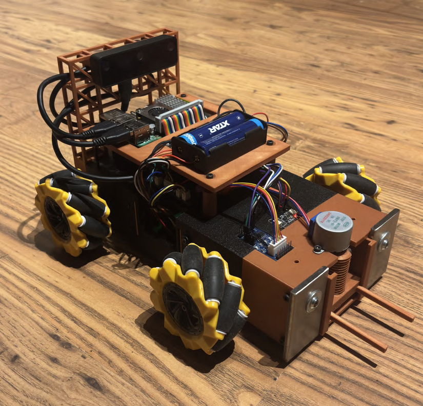
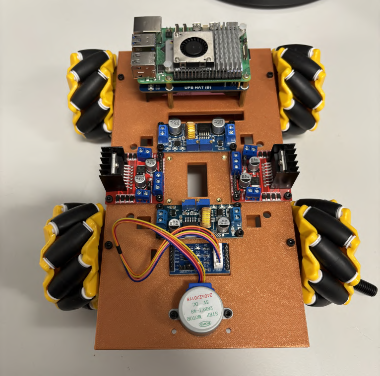
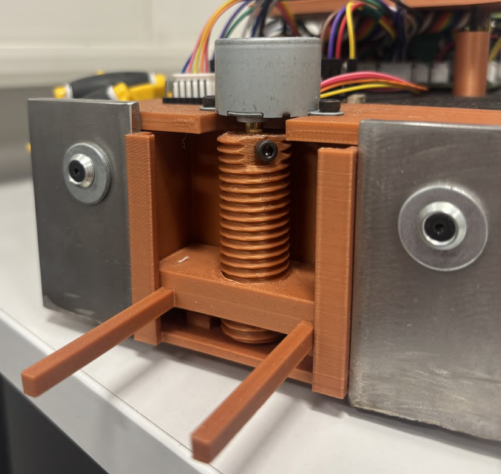
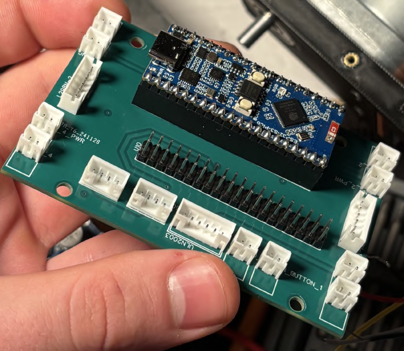
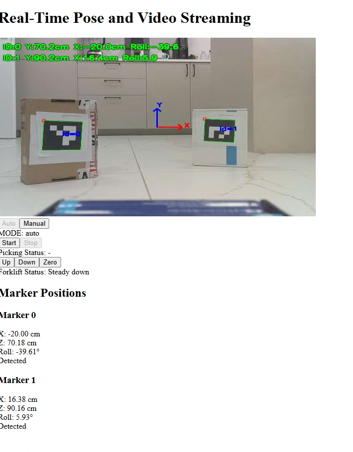

<p align="center">
  
</p>

<h1 align="center">Mecanum Wheels Mobile Robot</h1>

<p align="center">
  <strong>Autonomous mobile robot with omnidirectional movement for object recognition and transport</strong>
</p>

<p align="center">
  <em>Engineering Thesis Project — Poznań University of Technology, 2025</em>
</p>

---

## Overview

This project presents the design and construction of a mobile robot with a Mecanum wheel drive system, capable of **recognizing marked objects** and **autonomously transporting them** to designated locations.

The robot uses **computer vision** with ArUco markers to identify pickup and drop-off points, then autonomously navigates to complete the transport task using real-time feedback control.

### Key Capabilities

- **Omnidirectional Movement** — Move in any direction without rotating (forward, backward, sideways, diagonal)
- **Autonomous Navigation** — Vision-guided approach to marked targets
- **Object Transport** — Integrated forklift mechanism for lifting and carrying pallets
- **Real-time Control** — Web-based interface for monitoring and manual control
- **Precision Positioning** — PID-controlled motor speeds for accurate movement

---

## Mechanical Design

### Platform Construction

The chassis was custom-designed in **Fusion 360** and manufactured using **3D printing** (PLA material on Bambu Lab printers). The design went through several iterations to optimize:

- Component placement and cable management
- Weight distribution across all four wheels
- Accessibility for maintenance

<p align="center">
  
</p>

### Mecanum Wheels

Mecanum wheels feature rollers mounted at 45° angles around the wheel circumference. When the four wheels rotate at different speeds and directions, the robot can move in any direction:

| Movement | Front Left | Front Right | Rear Left | Rear Right |
|----------|:----------:|:-----------:|:---------:|:----------:|
| Forward  | + | + | + | + |
| Backward | − | − | − | − |
| Right    | + | − | − | + |
| Left     | − | + | + | − |
| Rotate CW| + | − | + | − |
| Rotate CCW| − | + | − | + |

The robot uses 80mm Mecanum wheels from DFRobots with silicone rubber rollers for optimal traction.

### Forklift Mechanism

The front-mounted forklift operates via a lead screw driven by a stepper motor:
- **Lifting capacity**: Small wooden pallets
- **Position sensing**: Tactile switches for zero-position detection
- **Control**: Manual (via web interface) or automatic (during transport sequence)

<p align="center">
  
</p>

---

## Electronics & Hardware

### Main Components

| Component | Description |
|-----------|-------------|
| **Raspberry Pi 5** (8GB) | Main computing unit — runs vision processing, decision logic, and web server |
| **ESP32-S3-Pico** | Motor control microcontroller — handles PWM, encoders, and PID regulation |
| **OAK-D-Lite Camera** | Stereo depth camera with 4K main sensor for ArUco marker detection |
| **L298N Motor Drivers** (×2) | Dual H-bridge drivers for DC motor control |
| **DC Motors with Encoders** (×4) | 12V geared motors (240 RPM) with magnetic encoders (462 pulses/revolution) |
| **Stepper Motor + ULN2003** | Forklift drive system |
| **18650 Li-ion Batteries** | Separate power supplies for logic and motors |

### System Architecture

```
┌──────────────────┐
│    Web Browser   │
│    (React UI)    │
└───────┬──────────┘
        │ WebSocket
        ↓
┌──────────────────────────────────────────┐
│           Raspberry Pi 5                 │
│           (Python)                       │
│                                          │
│  • Vision System (ArUco + OAK-D-Lite)    │
│  • Decision Logic (Movement control)     │
│  • FastAPI Server (WebSocket endpoints)  │
│                                          │
└───────┬──────────────────────────────────┘
        │ UART
        ↓
┌─────────────────┐      PWM + Dir      ┌─────────────────┐
│   ESP32-S3      │─────────────────────│   L298N ×2      │
│   Motor Driver  │←────────────────────│   + DC Motors   │
│   (PID Control) │     Encoder pulses  │   with Encoders │
└─────────────────┘                     └─────────────────┘
```

### Custom PCB

A 4-layer custom PCB serves as a buffer board connecting all components:
- Encoder signal routing
- Motor driver connections
- I2C expansion ports
- ESP32-S3 mounting

<p align="center">
  
</p>

---

## Vision System

### ArUco Marker Detection

The robot uses **ArUco markers** (DICT_4X4_50 dictionary) for:
- **Marker ID 0**: Pickup location
- **Marker ID 1**: Drop-off location

The OAK-D-Lite camera provides:
- 4K resolution main sensor
- 30 FPS real-time processing
- Built-in calibration data

### Pose Estimation

For each detected marker, the system calculates:
- **Position (X, Z)** — Distance from camera in centimeters
- **Orientation (Roll/Yaw)** — Rotation angle for alignment

```
Inverse Kinematics:
ωFL = (1/r)[vx − vy − (lx + ly)ωz]
ωFR = (1/r)[vx + vy + (lx + ly)ωz]
ωRL = (1/r)[vx + vy − (lx + ly)ωz]
ωRR = (1/r)[vx − vy + (lx + ly)ωz]
```

---

## Autonomous Transport Sequence

When the **Start** button is pressed, the robot executes:

1. **Angle Alignment** — Rotate to face the pickup marker (ID: 0) perpendicularly
2. **X-Axis Alignment** — Strafe left/right until centered with the marker
3. **Direct Drive** — Approach the target using real-time visual feedback with proportional control
4. **Pickup** — Raise the forklift (20 seconds)
5. **Retreat & Search** — Back up and rotate to find the drop-off marker (ID: 1)
6. **Repeat Approach** — Navigate to the drop-off location
7. **Drop-off** — Lower the forklift and complete the task

---

## Web Interface

The robot features a **real-time web interface** built with React and FastAPI:

<p align="center">
  
</p>

### Features

- **Live Video Stream** — Camera feed with marker overlay and pose data
- **Mode Selection** — Switch between Manual and Auto modes
- **Forklift Control** — Up, Down, and Zero position buttons
- **Status Display** — Real-time picking process status
- **Marker Tracking** — Position and orientation of detected markers

### Communication

- **Protocol**: WebSocket for real-time bidirectional data
- **Format**: JSON messages
- **Endpoints**: `/video`, `/pose`, `/mode`, `/forklift`, `/runPick`

---

## Technology Stack

### Robot Control (Python)
- **FastAPI** — Async web server with WebSocket support
- **OpenCV** (`opencv-contrib`) — ArUco marker detection and pose estimation
- **DepthAI** — OAK camera interface and calibration
- **asyncio** — Concurrent task management

### Motor Driver (C++)
- **PlatformIO** + Arduino framework
- **ESP32-S3** with interrupt-driven encoders
- **PID Control** — Individual tuning per motor
- Source code: [**Mecanum-Motor-Driver-ESP32-S3**](https://github.com/qemc/Mecanum-Motor-Driver-ESP32-S3)

### Web Interface (TypeScript/React)
- **React** + Vite
- **WebSocket** hooks for real-time updates
- Component-based UI architecture

---

<p align="center">
  <em>Engineering Thesis — Poznań University of Technology, 2025</em><br/>
  <strong>Author:</strong> Grzegorz Fabiś
</p>


